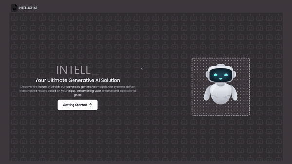

# IntelliChat 🌟

Welcome to **IntelliChat**, a modern chat application with a sleek, intuitive user interface and advanced features. This README provides an overview of the application, demo content, and details about the technologies used to create it.

## Demo 🎥

### Video Demo

## Features ✨

- **Generative AI Conversations**: Engage in AI-driven chat interactions powered by the Gemini API, designed for intelligent and dynamic conversations.
  - **Homework Assistance**: Get help summarizing complex topics and receiving explanations tailored to your needs.
  - **Content Creation**: Generate text, summaries, or even ideas for projects and assignments effortlessly.
  - **Personalized Interactions**: The AI adapts to user preferences to provide more meaningful and context-aware responses.
  - **And Much More**: Enjoy other advanced AI functionalities typical of a modern generative AI platform.
- **User Authentication**: Secure login and signup powered by Clerk, ensuring a smooth user management experience.
- **Efficient Data Management**: Built with TanStack, which handles chat data and updates efficiently for a smooth user experience.
- **Chat List**: View and manage your chat history effortlessly through a well-organized, easy-to-navigate interface.

## Technologies Used 🛠️

- **Frontend**: 
  - React ⚛️
  - Tailwind CSS 🎨
  - TanStack 📈

- **Backend**:
  - Node.js 🚀
  - MongoDB 🗄️
  - Clerk for authentication 🔐
